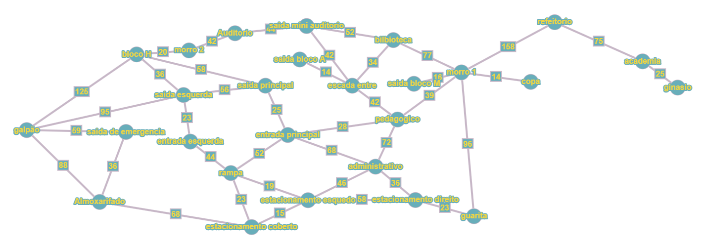

# Algoritmos de Busca

## Introdução

O projeto realizado pode ser acessado [aqui](https://sousaz.github.io/algoritmo_de_busca/))

Foi construido 3 algoritmos de busca sendo eles:

- Algoritmo de busca Gulosa

- Algortimo de busca A*

- Algortimo de Dijkstra

Para os algortimos de busca gulosa e A*, foi utilizado a heurística da distância euclidiana.
``` javascript
return Math.sqrt(Math.pow(verticeAtual.x - objetivo.x, 2) + Math.pow(verticeAtual.y - objetivo.y, 2))
```

Como escolha para o x e y, utilizamos o [Google Maps](https://www.google.com.br/maps/preview), para reocolhermos dados das coordernadas.

As coordenadas não são 100% precisas, podendo gerar resultados errôneos

Como coordenadas são medidas em graus e estavamos usando o custo em metros, também foi utilizado uma formula de aproximação de graus para metros, sendo ela:

```
x = x * 110.000
y = y * 110.000 * cos((x * 110.000) * (PI / 180))
```

## Material utilizado

Grafo criado no [graphonline](https://graphonline.ru/pt#)



Matriz criada no Planilha Google [acesse aqui](https://docs.google.com/spreadsheets)

Esses materiais foram utilizados para decidir heurísticas e se basear espacialmente.
